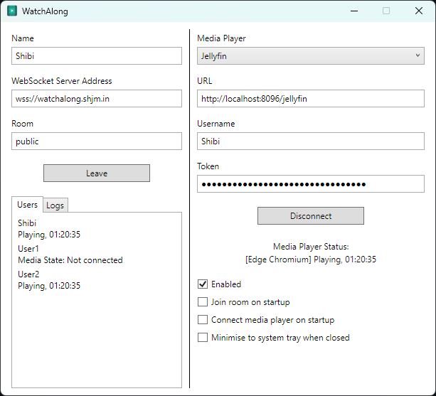

# WatchAlong

WatchAlong is a desktop application designed to synchronise media playback across multiple users.

## Server

https://github.com/shibijm/watchalong-server

## Download

Downloadable builds are available on the [releases page](https://github.com/shibijm/watchalong/releases).

## Supported Media Players

- Jellyfin
- VLC
